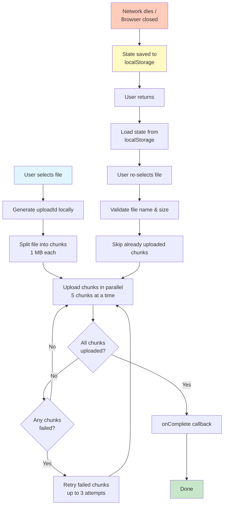

# Resumable AI File Upload System

A modern, resilient file upload system built with React, Vite, TypeScript, and Tailwind CSS. This application implements chunked file uploads with automatic resume capability, perfect for uploading large AI datasets, model artifacts, or training files.

## Actual Implementation (Frontend Only)




## Features

- **Chunked Uploads**: Automatically splits large files into 1 MB chunks for efficient uploads
- **Parallel Processing**: Uploads up to 5 chunks simultaneously for faster performance
- **Resume Capability**: Automatically resumes interrupted uploads from where they left off
- **Retry Logic**: Automatically retries failed chunks (up to 3 attempts)
- **Pause/Resume**: Manual control to pause and resume uploads
- **Progress Tracking**: Real-time progress visualization with chunk-level status
- **Persistent State**: Uses localStorage to maintain upload state across sessions
- **Drag & Drop**: Intuitive drag-and-drop file selection
- **Speed Control**: Configurable upload speed (Fast, Normal, Slow, Very Slow) for testing
- **Beautiful UI**: Modern, responsive design with Tailwind CSS

## Tech Stack

- **React 18** - UI library
- **TypeScript** - Type safety
- **Vite** - Build tool and dev server
- **Tailwind CSS** - Styling
- **Vitest** - Testing framework
- **React Testing Library** - Component testing
- **localStorage** - Client-side state persistence

## 📦 Installation

1. Clone the repository or navigate to the project directory:
```bash
cd "resumable_ai_file_upload_system"
```

2. Install dependencies:
```bash
npm install
```

3. Start the development server:
```bash
npm run dev
```

4. Open your browser and navigate to the URL shown in the terminal (typically `http://localhost:5173`)

## Usage

### Basic Upload

1. **Choose Upload Speed** (optional):
   - Select upload speed from the dropdown before selecting a file
   - Options: Fast (50-150ms), Normal (150-300ms), Slow (500-1000ms), Very Slow (1000-2000ms)
   - Speed preference is saved and persists across sessions

2. **Select a File**: 
   - Click the upload area or drag and drop a file
   - The file will automatically be split into 1 MB chunks

2. **Monitor Progress**:
   - Watch real-time progress in the progress bar
   - View individual chunk status in the grid
   - See statistics: uploaded chunks, failed chunks, time remaining

3. **Control Upload**:
   - **Pause**: Temporarily stop the upload
   - **Resume**: Continue from where you left off
   - **Retry Failed**: Manually retry chunks that failed

### Resume Upload

If an upload is interrupted (browser closed, network issue, etc.):

1. **View Previous Uploads**: Scroll down to see a list of incomplete uploads
2. **Resume**: Click the "Resume" button next to the upload
3. **Select File**: Re-select the same file (the app validates file name and size)
4. **Continue**: The upload will automatically skip already uploaded chunks

### Delete Uploads

- Click "Delete" to remove an upload from the list
- This clears the upload state from localStorage

## Project Structure

```
src/
├── assets/             # Static assets
│   └── icons/             # SVG icon components
│       ├── UploadIcon.tsx
│       ├── ChevronDownIcon.tsx
│       └── index.ts
├── components/         # React components
│   ├── FileUpload.tsx      # File selection with drag & drop + speed selector
│   ├── UploadProgress.tsx  # Progress display and controls
│   └── ResumeUploads.tsx   # List of previous uploads
├── hooks/              # Custom React hooks
│   └── useResumableUpload.ts  # Main upload logic
├── types/              # TypeScript type definitions
│   └── upload.ts
├── utils/              # Utility functions
│   ├── api.ts              # Simulated API calls
│   ├── fileChunker.ts      # File chunking logic
│   └── uploadState.ts      # localStorage management
├── test/               # Test setup
│   └── setup.ts
├── App.tsx             # Main app component
├── main.tsx            # App entry point
└── index.css           # Global styles
```

## Testing

The project includes comprehensive unit tests for all utilities, hooks, and components.

### Run Tests

```bash
# Run all tests
npm test

# Run tests in watch mode
npm test -- --watch

# Run tests with UI
npm run test:ui

# Run tests with coverage report
npm run test:coverage
```

### Test Coverage

- **Utilities**: File chunking, state management, API simulation
- **Hooks**: Upload logic, parallel processing, retry mechanism
- **Components**: File selection, progress display, resume functionality

## How It Works

### File Chunking

Files are split into 1 MB chunks using the File API's `slice()` method:

```typescript
const chunk = file.slice(start, end);
```

### Parallel Uploads

The system uploads chunks in parallel batches (up to 5 at a time) for optimal performance:

```typescript
const batch = pendingChunks.slice(0, MAX_PARALLEL_UPLOADS);
await Promise.allSettled(batch.map(chunk => uploadChunk(chunk)));
```

### State Persistence

Upload state is stored in **localStorage** with the following structure:

```typescript
{
  uploadId: string;        // Unique identifier
  fileName: string;        // Original file name
  fileSize: number;        // Total file size
  totalChunks: number;     // Number of chunks
  chunkSize: number;       // Size of each chunk (1 MB)
  chunks: ChunkStatus[];   // Status of each chunk
  startTime: number;       // Upload start timestamp
  lastUpdate: number;      // Last update timestamp
}
```

### Resume Logic

When resuming:
1. Load upload state from localStorage
2. Identify which chunks are already uploaded
3. Skip uploaded chunks
4. Only upload missing or failed chunks

**Note**: Since localStorage cannot store File objects, users must re-select the file when resuming. The app validates that the file name and size match the original upload.

### Simulated API

Since there's no backend, the API is simulated with:
- **Configurable delays** based on selected speed:
  - Fast: 50-150ms delay
  - Normal: 150-300ms delay
  - Slow: 500-1000ms delay
  - Very Slow: 1000-2000ms delay (default)
- **10% failure rate** to test retry logic
- All uploads are "virtual" - no actual server storage

In a real implementation, you would replace `src/utils/api.ts` with actual API calls to your backend.

## 📡 API Simulation

The simulated API endpoints:

### `POST /api/upload/chunk`

Uploads a single chunk.

**Request:**
```typescript
{
  uploadId: string;
  chunkIndex: number;
  totalChunks: number;
  chunkData: Blob;
}
```

**Response:** Success (no body) or Error

### `GET /api/upload/:uploadId/chunks`

Gets list of already uploaded chunks (currently returns empty array).

**Response:**
```typescript
number[] // Array of chunk indices
```

## UI Components

### FileUpload
- Upload speed selector (dropdown with Fast, Normal, Slow, Very Slow options)
- Drag & drop zone
- File input with click-to-browse
- Visual feedback on drag over

### UploadProgress
- Progress bar with percentage
- Chunk status grid (color-coded: green=uploaded, red=failed, gray=pending)
- Statistics dashboard
- Control buttons (Start/Pause/Resume/Retry)
- Speed selector dropdown (can change speed during upload)

### ResumeUploads
- List of incomplete uploads
- List of completed uploads
- Resume and delete actions

## Limitations & Considerations

### localStorage Limitations

- **Storage Limit**: ~5-10 MB per domain (varies by browser)
- **No File Storage**: File objects cannot be stored in localStorage
- **Browser-Specific**: Data is specific to the browser and domain

### For Production Use

Consider these improvements:

1. **Backend Integration**: Replace simulated API with real backend endpoints
2. **IndexedDB**: Use IndexedDB for storing file chunks locally (larger capacity)
3. **File Validation**: Add file type and size validation
4. **Upload Limits**: Implement maximum file size limits
5. **Authentication**: Add user authentication for secure uploads
6. **Progress Persistence**: Store progress on server for cross-device resume
7. **Chunk Verification**: Add checksums/MD5 for chunk integrity
8. **Compression**: Add optional file compression before upload

## 📝 Scripts

```bash
npm run dev          # Start development server
npm run build        # Build for production
npm run preview      # Preview production build
npm test             # Run tests
npm run test:ui      # Run tests with UI
npm run test:coverage # Run tests with coverage
```

## AI-Specific Integration Aspects

This upload system is designed to integrate seamlessly into AI/ML workflows. Below are the key integration points and production considerations:

### 1. Integration into AI Workflows

#### Fine-Tuning Pipeline Integration

Once the upload completes, the system integrates with fine-tuning pipelines:

- **Event-Driven Architecture**: The server publishes a message (Kafka/PubSub) describing:
  - Dataset location and path
  - File metadata (size, type, format)
  - Schema information
  - Upload timestamp and user identity

- **Automated Processing**: The fine-tuning service consumes this message and automatically:
  - Initiates dataset preprocessing
  - Performs tokenization
  - Starts model training with the newly uploaded dataset

- **Workflow Benefits**: This ensures the upload pipeline feeds directly into ML model lifecycle workflows, enabling automated model training pipelines.

#### Data Curation & Labeling System Integration

After upload completion, files can be routed into data curation systems:

- **Validation & Sampling**: Files undergo validation, sampling, and quality checks
- **Metadata Attachment**: Upload metadata (size, file type, chunk count) is attached to curation workflows
- **Labeling Support**: Supports QA, annotation, and dataset refinement processes
- **Workflow Routing**: Files can be automatically routed based on content type, size, or user-defined rules

### 2. Data Quality & Validation

#### Schema & Format Validation

Before accepting a dataset, the system validates data quality:

- **Streaming Validation**: The upload service streams the reassembled file through a schema validator
- **Validation Types**:
  - JSON Schema validation for structured data
  - CSV header and row validation
  - Parquet schema verification
  - Custom format validators

- **Error Handling**: 
  - Invalid rows trigger rejection or partial acceptance workflows
  - Malformed files are rejected with detailed error messages
  - Ensures downstream training robustness

#### Metadata Generation for Data Catalog

During the finalization step, comprehensive metadata is generated:

- **Catalog Information**:
  - File size and checksum (MD5/SHA256)
  - Schema type and structure
  - Number of rows/records
  - Uploader identity and timestamp

- **Lineage Tracking**: 
  - Enables dataset lineage tracking across models
  - Supports reproducibility and auditability
  - Links datasets to fine-tuned models
  - Maintains compliance and governance records

### 3. Security & Compliance

#### Virus & Content Scanning

Before storing datasets, security scanning is performed:

- **Scanning Tools**:
  - **ClamAV**: Open-source antivirus engine
  - **VirusTotal**: Multi-engine malware detection
  - **In-house scanners**: Custom malware detection

- **Critical Use Cases**: 
  - Essential for files from external customers
  - Protects infrastructure from malicious content
  - Maintains data integrity

#### PII Detection for Compliant AI Datasets

After reassembly, the system performs PII detection:

- **Detection Tools**:
  - **Presidio**: Microsoft's PII detection framework
  - **Custom NLP models**: Domain-specific PII detection
  - **Pattern matching**: Regex-based detection for common PII types

- **Compliance Standards**:
  - **GDPR**: European data protection regulations
  - **HIPAA**: Healthcare data privacy
  - **SOC2**: Security and availability standards
  - **Internal governance**: Company-specific policies

- **Action Workflows**:
  - Files containing malware are quarantined
  - Files with prohibited PII are rejected
  - Compliance violations trigger alerts and audit logs
---

